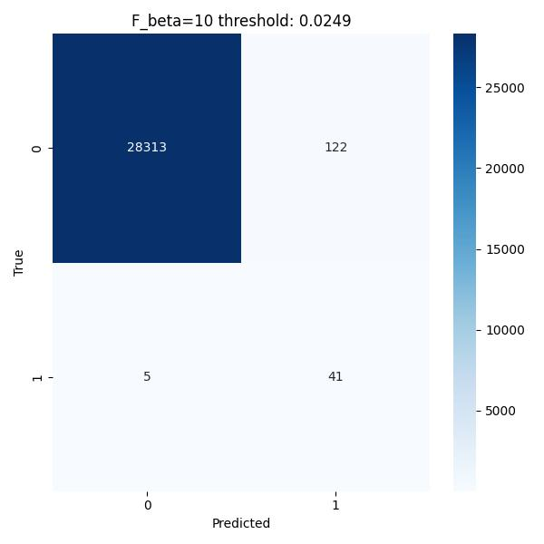
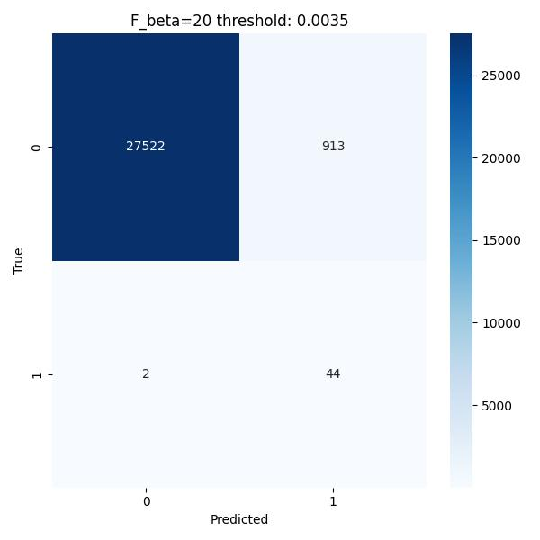

# Fraud-Detection

This repository contains experiments and code for detecting financial fraud in credit card transactions using various machine learning methods. The primary dataset comes from [Kaggle's credit card fraud dataset](https://www.kaggle.com/mlg-ulb/creditcardfraud).

## Overview

### The Challenge of Imbalance

The dataset presents a severe **class imbalance**, where legitimate transactions vastly outnumber fraudulent ones. This requires tuning both the model (using `scale_pos_weight` in XGBoost) and the final prediction threshold to prioritize **Recall**, minimizing **False Negatives** (missed fraud cases), which is critical in a financial context where lost revenue from fraud is highly costly.

## Modeling and Evaluation

The core model is an **XGBoost** (Gradient Boosted Decision Trees) classifier.

* **Configuration**: Parameters such as `max_depth`, `learning_rate`, `n_estimators`, and regularization terms were configured alongside `scale_pos_weight` to handle class imbalance effectively.
* **Validation**: A dedicated **validation set** was used to monitor performance and apply **early stopping**.
* **Metrics**: We evaluate performance based on **Precision** (model correctness when predicting fraud) and **Recall** (model ability to find all fraud cases), and the composite **F-measure** ($F_{\beta}$), where $\beta$ dictates the relative importance of Recall over Precision.

## Threshold Tuning for High Recall

The default prediction threshold of 0.5 leads to high Precision but poor Recall on imbalanced data. We tuned the threshold by examining the **Precision-Recall curve** to maximize $F_{\beta}$ with $\beta > 1$.

| Metric/Threshold | F-beta=1 (Threshold: 0.9988) | F-beta=10 (Threshold: 0.0249) | F-beta=20 (Threshold: 0.0035) |
| :--- | :--- | :--- | :--- |
| **True Positives (TP)** | 34 | 41 | 44 |
| **False Negatives (FN)** | 12 | 5 | 2 |
| **Recall ($\frac{TP}{TP+FN}$)** | **73.9\%** | **89.1\%** | **95.7\%** |
| **Precision ($\frac{TP}{TP+FP}$)** | **100.0\%** | **25.2\%** | **4.6\%** |

---

## 📈 Results: Optimizing for Recall

By increasing the value of $\beta$ in the $F_{\beta}$ score, we shifted the decision threshold to prioritize Recall, achieving a significant improvement in detecting fraudulent transactions.

### 1. F1 Score Optimization ($\beta=1$)
This threshold maximizes the balance between Precision and Recall. It results in **perfect Precision (100\%)** but misses 12 out of 46 fraud cases, leading to only **73.9\% Recall**.


### 2. F-beta=10 Optimization ($\beta=10$)
By weighting Recall 10 times more important than Precision, the threshold shifts, dramatically reducing False Negatives (missed fraud) from 12 to 5.


### 3. F-beta=20 Optimization ($\beta=20$)
Further emphasizing Recall leads to the highest detection rate, missing only **2** out of 46 fraud cases, resulting in **95.7\% Recall**. This is the optimal trade-off when the cost of missing fraud outweighs the cost of investigating a false alarm (False Positive).


| **Key Takeaway** | |
| :--- | :--- |
| **Recall Improvement** | Threshold tuning based on $F_{\beta=20}$ increased **Recall from 73.9\% to 95.7\%**. |
| **Business Impact** | The method successfully reduced critical False Negatives by **83\%** (from 12 to 2), ensuring nearly all high-cost fraudulent transactions are flagged. |

---

## Dataset Imports

1.  **Kaggle CLI**:
    ```bash
    kaggle datasets download mlg-ulb/creditcardfraud
    ```
